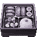
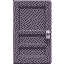
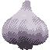
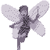
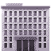
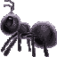

``Hello ( ´ ω ` )ノﾞ`` Welcome to my GitHub page, this is the showcase of my work. Among my projects, there are tools, documents, and creative expression. All of these are planned, designed, developed, and maintained by myself. 

### Front-End Libraries

|  |  |  |
|---|---|---|---|
| [Lunchbox](https://github.com/CarcajadaArtificial/ana-components) | [Sass Door](https://github.com/CarcajadaArtificial/sass-door) | [GarliCSS](https://github.com/CarcajadaArtificial/garlicss) |

### Websites

|  |  |
|---|---|
| [Pixie](https://github.com/CarcajadaArtificial/pixie) | [Stale City](https://github.com/CarcajadaArtificial/stale-city-website) |

### Engines

|  |  |
|---|---|
| [Myrmex](https://github.com/CarcajadaArtificial/Myrmex) | [ana.js](https://github.com/CarcajadaArtificial/ana.js) |